# Bamazon

#### This project consists of two CLI applications that uses node packages to interact with the user. The information is stored locally on mySQL which means these applications can only be run if the user has/downloads: mySQL, a command-line program, and this repository. 
    App 1 - Bamazon Pet Shop: See what is available and make a purchase if you wish. 
    App 2 - Bamazon Manager POS: View inventory, update item quantities, and add new items. 

## Link To Github Repository 
[https://github.com/jshou403/Bamazon](https://github.com/jshou403/Bamazon)

## How The Apps Work
The two [node.js] packages used here are [inquirer] and [mySQL]. The [inquirer] node package is used to display a prompt to the user, in this case it will be a list of choices, which then takes the user's response and performs an action that is tied to the response. The [mysql] node package is used to make connections to the mySQL database in order to display information to the user and to complete user requested updates to the database. 

## Take Apps for a Run
### App 1 - Bamazon Pet Shop
`node bamazon-shop.js`

* Lets's go to the Bamazon Pet Shop! 
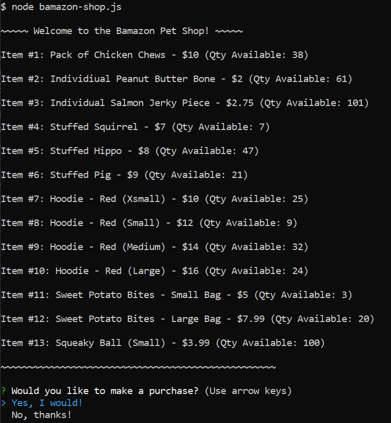

* Let's make a purchase. How about all the Stuffed Squirrels? 
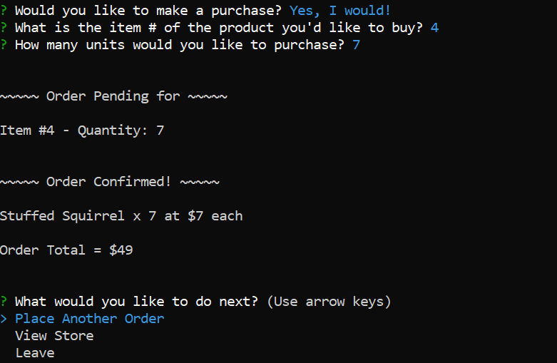

* Let's make another purchase! Just 1 small Squeaky Ball this time. 
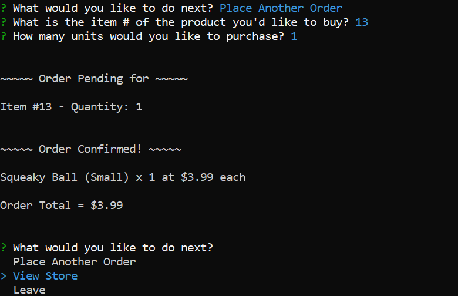

* If we view the store again, there are now no more Stuffed Squirrels. And there is 1 less small Squeaky Ball than there was before. 
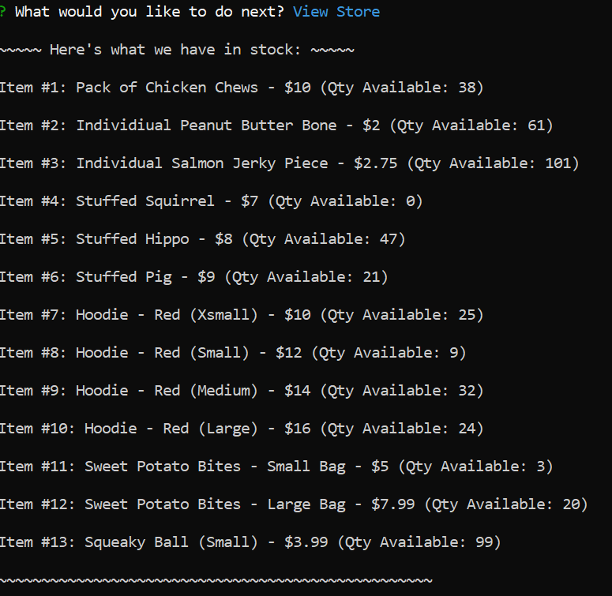

* We can't submit any letters but we can try some invalid numbers!
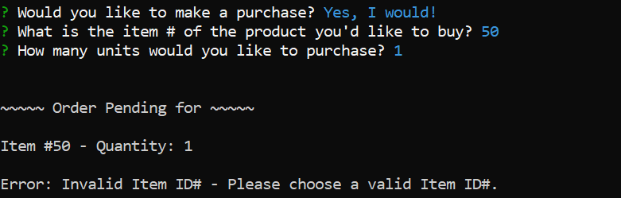 
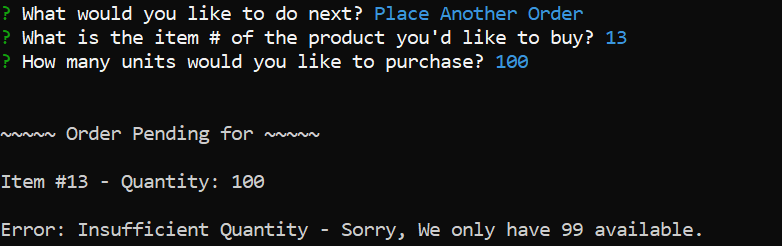 
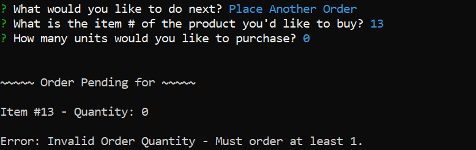

### App 2 - the Bamazon Manager POS
`node bamazon-pos.js`

* Lets's view the Manger POS. 
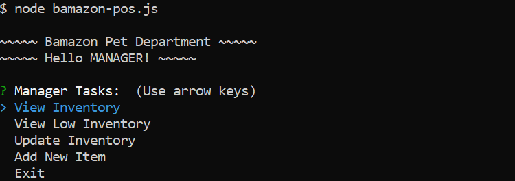

* Lets's view our inventory. 
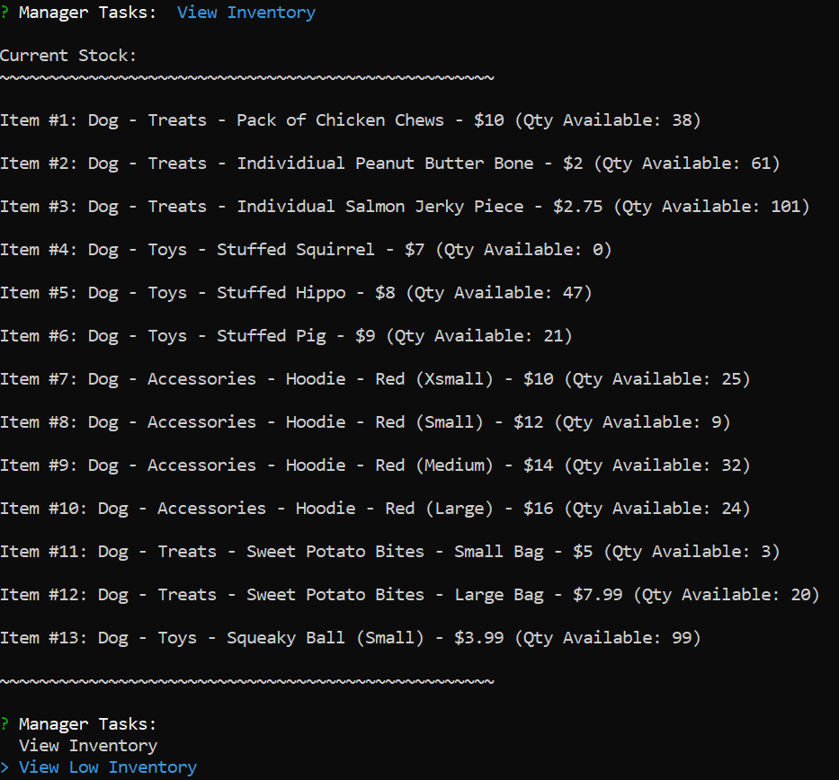

* Show me just the low inventory (quantities under 10). It looks like we've sold out of Item #4. 
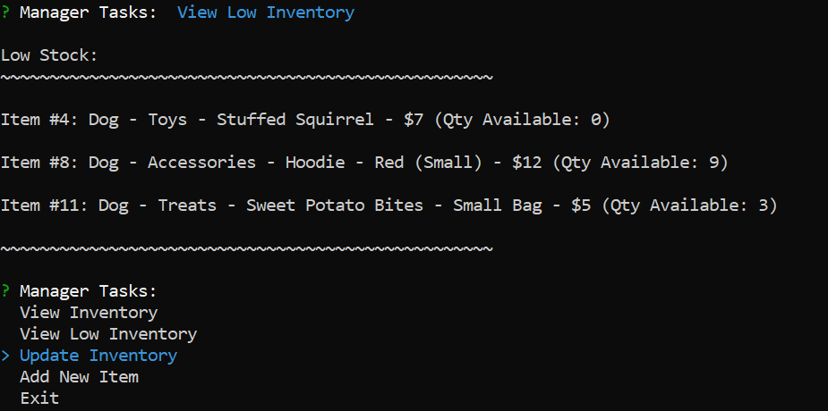

* We just got a new shipment of 25 for Item #4. Let's update our inventory. 
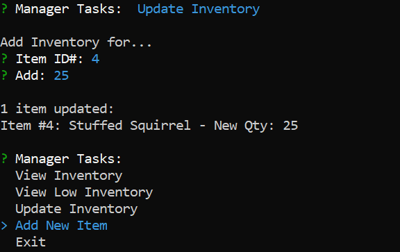

* Looks like we received the first shipment of the large Squeaky Ball too. Let's add this new item to our inventory. 
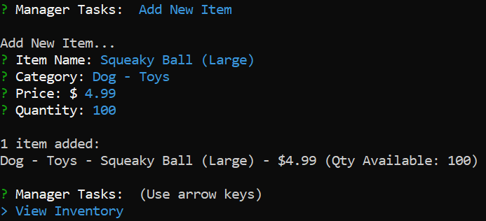

* If we check our inventory, it looks like the new item is added (Item #14) and Stuffed Squirrels (Item #4) are now in stock. 
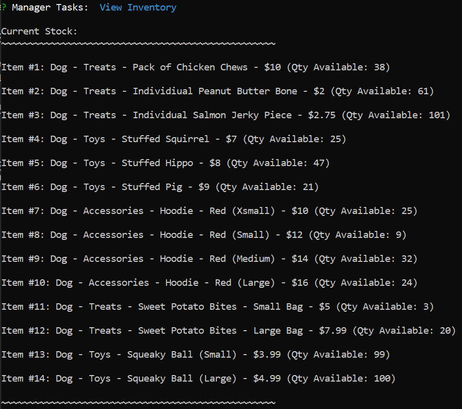

## Technologies Used
* Javascript
* Node.js
* MySQL

## Developer
Jacalyn Shou 
* [Github](https://jshou403.github.io/)
* [LinkedIn](https://www.linkedin.com/in/jacalyn-shou/)
* [Portfolio](http://www.jacalynshou.com/)